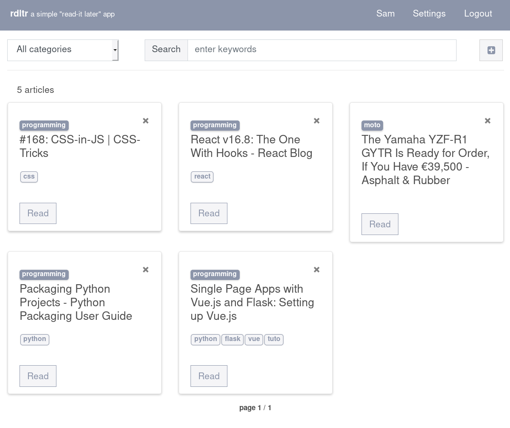

# rdltr

  

1

----

_just a small project to learn Vue (with Flask)_  

  

**_work in progress_**  

Sources: 
- application structure inspired by this tutorial: [Full-stack single page application with Vue.js and Flask](https://codeburst.io/full-stack-single-page-application-with-vue-js-and-flask-b1e036315532)

---

Notes:  
_1. Test coverage: only for Python_
