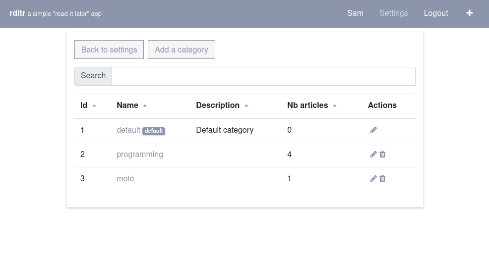
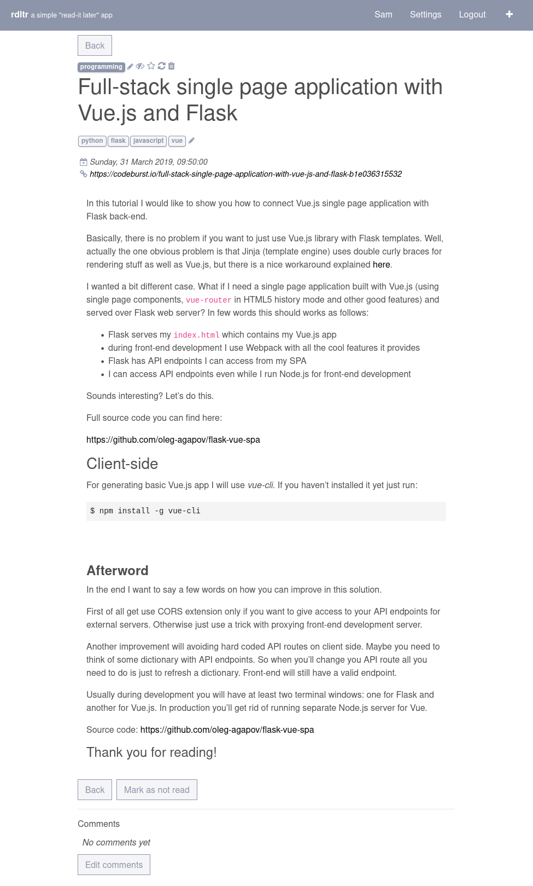

Features
========

Users
^^^^^

- User can register.
- User registration can be disabled with the environment variable `RDLTR_ALLOW_REGISTRATION` initialized to `false` (see `Installation <installation.html>`__)

.. note::
    **rdltr** was originaly intended to be mono-user. No administration is planned for now.

Settings
^^^^^^^^

- User can add and modify **categories** and **tags**.

   **rdltr** settings

- Categories.

   **rdltr** categories (example)

Pre-existing default category can not be deleted.

- Tags

.. figure:: _images/screenshot_tags.png
   :alt: rdltr tags screenshot

   **rdltr** tags (example)

Articles
^^^^^^^^
- User can add article from an URL: **rdltr** get only article content (server-side scraping).

.. figure:: _images/screenshot_add.png
   :alt: rdltr screenshot

   example of an artcile saved with **rdltr**

- Articles can be organized into categories and tagged. If the category is not specified, the article is added into the default category.
- Articles can be marked as **read**.
- Articles can be marked as **favorite**.
- Article content can be reloaded (only server-side scraping).

.. warning::
    if the content was scraped browser-side, the reloaded content can be incomplete or different.

- User can add comments.
- A keywords **search** is available.

.. figure:: _images/screenshot.png
   :alt: rdltr screenshot

Share from others applications to rdltr
^^^^^^^^^^^^^^^^^^^^^^^^^^^^^^^^^^^^^^^
- It is possible to add articles from `FreshRSS <https://freshrss.org/>`__.

To add **rdtlr** share link, select "**wallabag v2**" and enter **rdltr** instance URL:

The share link will be available in the feed item:

.. figure:: _images/freshrss_share_link.png
   :alt: freshrss share link screenshot

Web Extension
^^^^^^^^^^^^^

- A `Firefox add-on <https://addons.mozilla.org/en-US/firefox/addon/rdltr/>`__ is available. It allows to add content from browser side.

.. figure:: _images/addon_popup.png
   :alt: add-on popup screenshot

- To configure it, enter instance url and credentials to connect to **rdltr**.

.. figure:: _images/addon_settings.png
   :alt: add-on options screenshot
